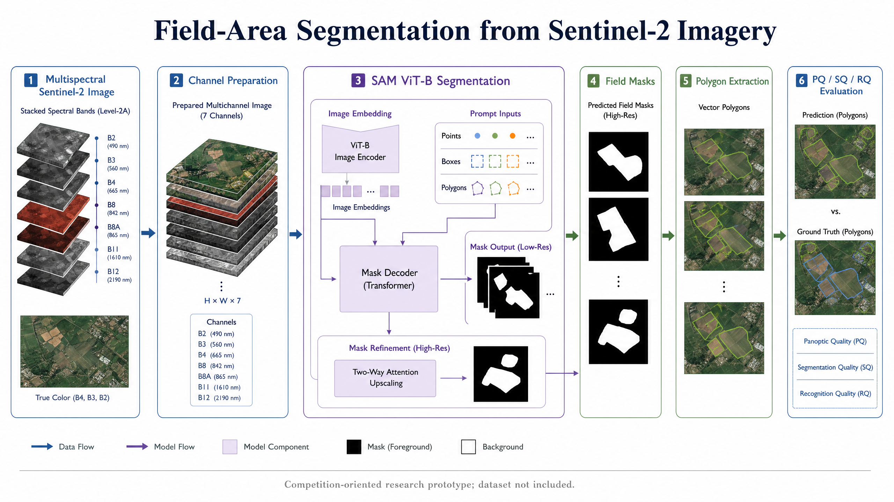

# Field-Area Segmentation from Sentinel-2 Imagery

This project segments agricultural field regions from multispectral Sentinel-2 satellite images. It was developed for the Field Area Segmentation competition and uses a Segment Anything Model (SAM) ViT-B backbone, mask-to-polygon conversion, and panoptic segmentation metrics.

The repository is useful as both a competition solution and a compact example of a remote-sensing segmentation workflow. The original notebook is preserved in `notebooks/main.ipynb`; the added documentation makes the data flow and evaluation choices easier to follow without changing the experiment code.

## Project overview

The input consists of multi-channel Sentinel-2 imagery, including RGB, near-infrared, and other spectral bands. The model produces segmentation masks for agricultural field regions. Those masks are then converted into polygons so that the result can be used for boundary-level analysis rather than only pixel-level visualization.



*Figure 1. Research architecture for the Sentinel-2 field-area segmentation experiment.*

The project reports a private-leaderboard rank of **40th**, corresponding to the **top 7%**, after 33 submissions. It also reports the following evaluation values:

| Metric | Reported value |
|---|---:|
| Panoptic Quality (PQ) | 85.3% |
| Segmentation Quality (SQ) | 87.1% |
| Recognition Quality (RQ) | 82.9% |

These values belong to the reported competition workflow and should not be read as a guarantee of performance on a different geographic area or image collection.

## Pipeline

1. Load and prepare the Sentinel-2 image channels.
2. Generate segmentation masks with the SAM-based workflow.
3. Convert masks into polygons representing field boundaries.
4. Evaluate segmentation and recognition quality with PQ, SQ, and RQ.

## Repository structure

```text
Field-Area-Segmentation/
├── notebooks/
│   └── main.ipynb                Original end-to-end notebook
├── requirements.txt              Python dependencies
├── docs/
│   ├── architecture.mmd          Architecture source
│   └── architecture.png          Rendered architecture diagram
├── LICENSE
└── README.md
```

## Data layout

The notebook expects Sentinel-2 image data to be arranged in a local data directory similar to:

```text
data/
└── sentinel_images/
    ├── image_1.tif
    ├── image_2.tif
    └── ...
```

The images use GeoTIFF-style raster data and contain the spectral channels needed by the segmentation workflow. The dataset is not included in this repository.

## Setup and notebook usage

```bash
git clone https://github.com/zulqarnainalipk/Field-Area-Segmentation.git
cd Field-Area-Segmentation
python -m venv .venv
source .venv/bin/activate
pip install -r requirements.txt
jupyter lab notebooks/main.ipynb
```

The notebook is kept as the primary experiment record. If you adapt the project, record the data split, model configuration, submission count, and evaluation protocol so that a future result can be compared fairly with the reported competition run.

## Possible extensions

The original project identifies several reasonable next steps: using temporal Sentinel-2 observations, combining multiple segmentation models, and refining polygon extraction around field boundaries. These are research directions rather than claims about functionality already implemented in this repository.

## Author

**Zulqarnain Ali**  
Machine Learning Researcher  
Email: [zulqar445ali@gmail.com](mailto:zulqar445ali@gmail.com)  
Website: [zulqarnainali.com](https://zulqarnainali.com)  
GitHub: [github.com/zulqarnainalipk](https://github.com/zulqarnainalipk)  
LinkedIn: [linkedin.com/in/zulqarnainalipk](https://linkedin.com/in/zulqarnainalipk)  
ORCID: [0009-0009-0281-882X](https://orcid.org/0009-0009-0281-882X)

## License

The project is released under the MIT License. Review the source imagery and competition terms before redistributing data or derived assets.
